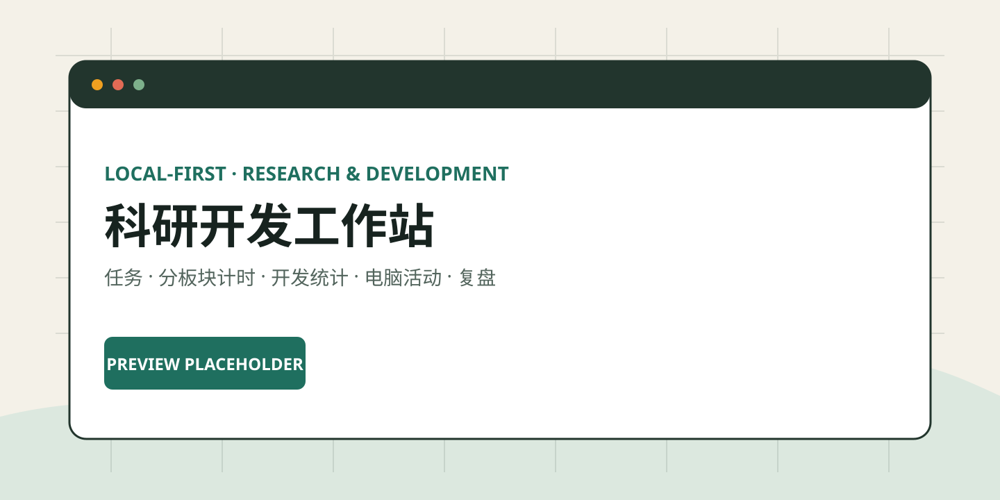
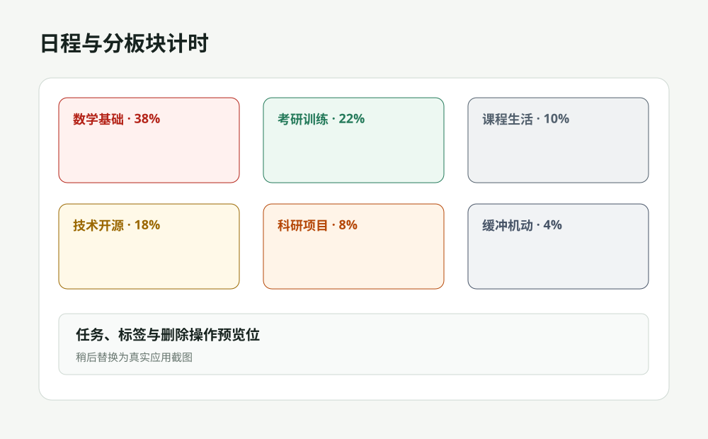
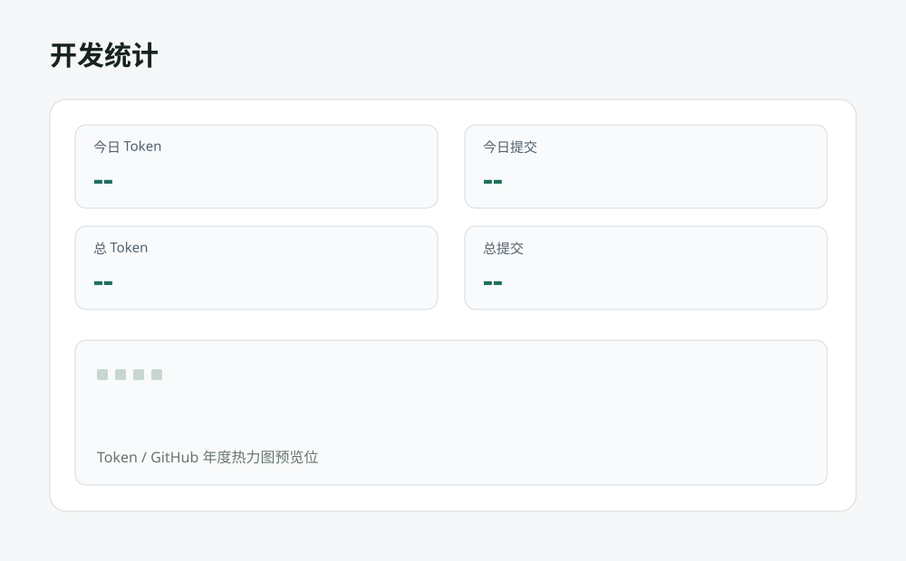
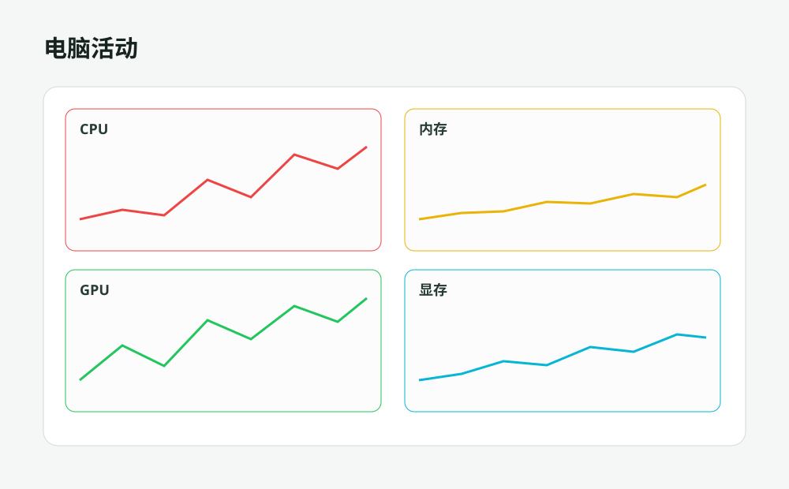

# 科研开发工作站


本地优先的科研开发全流程记录工作站。它把任务规划、分板块弹性计时、开发活动统计、电脑资源监控、音乐和每日复盘放在一个可自托管界面中，帮助研究者与开发者留下连续、可追溯的工作记录。



> `1.0.0` 是首个正式发布版本。核心任务、计时与设置数据默认写入本地 SQLite；外部数据源均可选，发行版本不预置维护者的账号、绝对路径或私人歌单。

## 界面预览

<table>
  <tr>
    <td width="50%"></td>
    <td width="50%"></td>
  </tr>
  <tr>
    <td align="center"><strong>日程与分板块计时</strong></td>
    <td align="center"><strong>开发统计</strong></td>
  </tr>
  <tr>
    <td width="50%"></td>
    <td width="50%"></td>
  </tr>
  <tr>
    <td align="center"><strong>电脑活动与系统资源</strong></td>
    <td align="center"><strong>音乐与每日复盘</strong></td>
  </tr>
</table>

这些 SVG 是可直接替换的预览位。发布截图准备完成后，保持文件名不变即可更新 README 中的整组图片。

## 核心能力

- 日程与任务：创建、归类、添加自定义标签、删除任务，并从任务直接开始专注。
- 六类默认板块：数学基础、考研训练、课程生活、技术开源、科研项目、缓冲机动；默认配比为 38 / 22 / 10 / 18 / 8 / 4。
- 弹性计时：支持任务计时、按板块计时、暂停、继续、结束、手动拆分和调整记录；默认策略为弹性 50 + 10。
- 开发统计：展示今日 Token、今日提交、累计 Token、累计提交，以及 Token / GitHub 活动热力图。
- 电脑活动：只读聚合 ActivityWatch 的应用、窗口、网页域名与当天时间线，同时实时采样 CPU、内存、GPU、显存与可用温度指标。
- 音乐：统一的独立页与嵌入式播放器，歌词和播放列表在固定区域内滚动。
- 每日复盘：聚合任务、专注记录、开发统计和音乐状态，形成可回看的日记录。
- 可选 ActivityWatch：仍可作为专注证据来源，但不影响任务、计时和资源监控的基础功能。

## 本地优先

- 任务、板块、计时、设置和复盘存储在本地 SQLite。
- ActivityWatch 当天活动和 CPU / GPU / 内存短时采样只用于本机页面展示，不写入工作站数据库。
- GitHub 用户名、Token collector 路径、音乐服务地址与歌单默认留空。
- ActivityWatch 通过本机 `aw-server` 只读接入；窗口标题等数据按敏感信息处理。
- 项目不要求云账户，也不会在未配置时连接维护者的私人服务。

## 架构

```text
apps/homepage          Next.js 主界面与本机资源采样 API
apps/desktop-shell     Electron 桌面外壳、托盘与 Windows 安装包
services/workbench-core
                       Fastify + SQLite，管理任务、计时、统计与复盘
packages/contracts     跨模块 TypeScript 数据契约
packages/theme         工作站主题与组件样式
```

Homepage 负责展示与编排，`workbench-core` 负责状态与规则。复杂业务数据不会写入 Homepage YAML。

## 快速开始

Windows 用户可直接下载 [ResearchWorkstation 1.0.0 安装包](https://github.com/proffitteoy/Task-Manager/releases/download/v1.0.0/ResearchWorkstation-1.0.0-x64.exe)。

要求：Node.js 20 或更高版本、pnpm 11。

```bash
pnpm install
pnpm dev
```

启动后访问：

- 工作站：`http://localhost:3000`
- 设置：`http://localhost:3000/settings/workstation`
- Core 健康检查：`http://127.0.0.1:3900/health`

也可以分别启动：

```bash
pnpm dev:core
pnpm dev:homepage
```

## 配置

所有个人配置都应通过环境变量或设置页提供，不应提交到仓库。

| 变量 | 默认值 | 用途 |
|:---|:---|:---|
| `HOST` | `127.0.0.1` | Core 监听地址 |
| `PORT` | `3900` | Core 端口 |
| `DATABASE_URL` | `file:./data/workbench.sqlite` | SQLite 数据库 |
| `WORKBENCH_CORE_URL` | `http://127.0.0.1:3900` | Homepage 访问 Core 的地址 |
| `ACTIVITYWATCH_URL` | `http://127.0.0.1:5600` | 可选 ActivityWatch 地址 |
| `TOKEI_REPO` | 空 | Token collector 目录 |
| `TOKEI_PYTHON` | 自动探测 | Collector Python 解释器 |
| `GITHUB_USERNAME` | 空 | GitHub 贡献统计用户名 |
| `MUSIC_SERVICE_URL` | 空 | 可选远程音乐服务 |

## 开发与验证

```bash
pnpm build
pnpm test
pnpm lint

pnpm --filter @cw/workbench-core test
pnpm --filter homepage test
pnpm --filter homepage build
```

Windows 桌面包：

```bash
pnpm desktop:pack
pnpm desktop:dist
```

Docker：

```bash
docker compose -f deploy/docker-compose.yml up --build
```

## 参与贡献

欢迎提交问题、设计讨论与 Pull Request。贡献前请遵守以下边界：

1. 不提交 token、cookie、私钥、个人绝对路径或私人活动数据。
2. 修改 API 或数据库语义时同步 `packages/contracts`、测试和文档。
3. 保留 Homepage 上游边界，新增工作站能力优先放入 `workstation` 命名空间。
4. 直接引入第三方代码时保留版权、许可证与来源说明。

详细架构方向见 [项目说明](./docs/项目说明.md)，上游来源与许可证边界见 [上游能力整合](./docs/上游能力整合.md)。

## 许可证

本仓库按 [GPL-3.0-or-later](./LICENSE) 发布；Homepage fork 同样保留上游许可证。第三方组件可能适用各自许可证，详见 `docs/上游能力整合.md` 与应用内 NOTICE 文件。
